# VitaHealth Web: módulo con Servlets y JSP

**Evidencia GA7-220501096-AA2-EV02: Módulos de software codificados y probados**
SENA · Análisis y Desarrollo de Software · Grupo 5
Aprendices: Ingri Daniela Rojas, Luna Michell Montealegre, Luisa Fernanda Betancur
Repositorio: https://github.com/Vitahealth05/vitahealth-web

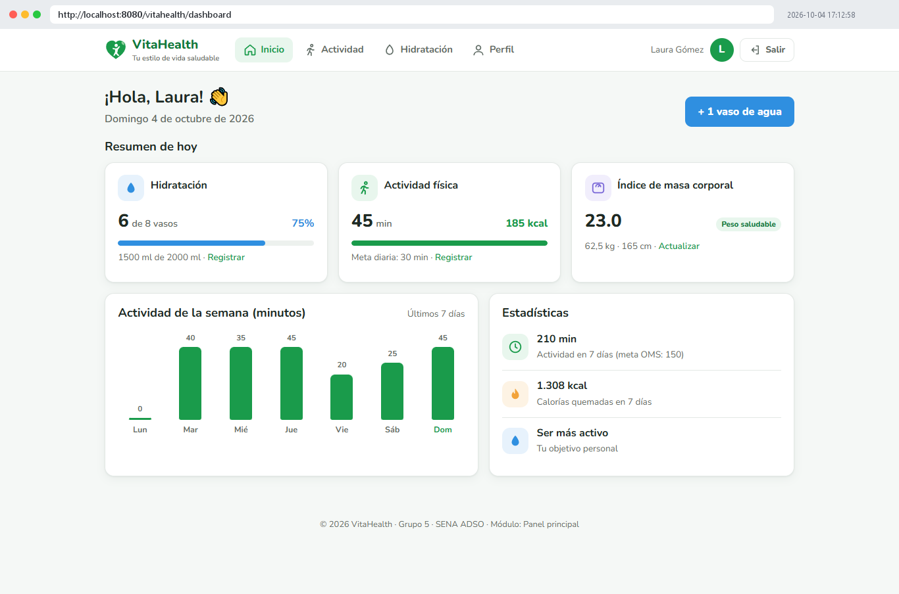

VitaHealth es una aplicación web y móvil para promover hábitos saludables. Este repositorio tiene el **módulo web de seguimiento de hábitos**, construido con **Java Servlets, JSP y JSTL** sobre **Apache Tomcat 10.1**. Incluye estas funciones:

| Pantalla (prototipo) | Requisito | Servlet | Vista JSP |
|---|---|---|---|
| 1. Bienvenida | — | — | `index.jsp` |
| 2. Inicio de sesión | RF02 | `LoginServlet` (`/login`) | `login.jsp` |
| 3. Crear cuenta | RF01 | `RegistroServlet` (`/registro`) | `registro.jsp` |
| 4. Panel principal y estadísticas | RF04, RF05, RF06 | `DashboardServlet` (`/dashboard`) | `dashboard.jsp` |
| 5. Seguimiento de hidratación | RF04 | `HidratacionServlet` (`/hidratacion`) | `hidratacion.jsp` |
| 6. Registro de actividad física | RF05 | `ActividadServlet` (`/actividad`) | `actividad.jsp` |
| 8. Perfil del usuario | RF03, RF08 | `PerfilServlet` (`/perfil`) | `perfil.jsp` |
| Modal "Cerrar sesión" | — | `LogoutServlet` (`/logout`) | `fragmentos/navegacion.jspf` |

## Artefactos del ciclo de software que se tuvieron en cuenta

- **Requisitos e historias de usuario** (GA4-AA2-EV02, GA5-AA1-EV03): RF01 a RF08 y RNF01 a RNF05. En [`docs/historias-de-usuario-y-pruebas.md`](docs/historias-de-usuario-y-pruebas.md) está la trazabilidad completa.
- **Diagrama de clases y principios de POO** (GA4-AA2-EV02): la clase abstracta `Persona` se extiende en `Usuario` (herencia), `getRol()` muestra el polimorfismo y los atributos son privados con getters y setters (encapsulamiento).
- **Modelo de datos y script SQL** (GA6-AA2-EV03): tablas `usuarios`, `perfiles`, `actividades`, `registro_actividad` e `hidratacion`, con sus llaves, restricciones `CHECK` e índices. Ver [`database/vitahealth_postgresql.sql`](database/vitahealth_postgresql.sql).
- **Prototipos y mapa de navegación** (GA5-AA1-EV03/EV05): mismos colores, tarjetas, anillo de hidratación, vasos, barra de navegación y modal de cierre de sesión.
- **Arquitectura** (GA1-AA2-EV05, GA4-AA2-EV06): capas MVC. El **modelo** son los POJO y el DAO con JDBC, la **vista** son las JSP con JSTL y el **controlador** son los servlets y filtros.

## Tecnologías

| Componente | Versión |
|---|---|
| Java (JDK) | 21 |
| Jakarta Servlet / JSP / JSTL | 6.0 / 3.1 / 3.0 |
| Servidor | Apache Tomcat 10.1 |
| Base de datos | H2 2.2 en modo PostgreSQL (desarrollo) · PostgreSQL 16 (producción) |
| Pruebas | JUnit 5 |
| Construcción | Maven (`pom.xml`) o scripts PowerShell sin instalación |
| Versionamiento | Git + GitHub |

## Formularios HTML con métodos GET y POST

| Formulario | Método | Servlet / método Java | Para qué |
|---|---|---|---|
| Iniciar sesión | `POST` | `LoginServlet.doPost` | Validar credenciales y crear la sesión |
| Crear cuenta | `POST` | `RegistroServlet.doPost` | Validar, cifrar la contraseña (PBKDF2) y guardar |
| + 1 vaso / botella / otra cantidad | `POST` | `HidratacionServlet.doPost` | Registrar agua |
| Deshacer último registro de agua | `POST` | `HidratacionServlet.doPost` | Eliminar el último registro |
| Agregar actividad | `POST` | `ActividadServlet.doPost` | Guardar la actividad y calcular calorías |
| Eliminar actividad (✕) | `POST` | `ActividadServlet.doPost` | Borrar un registro propio |
| **Filtrar historial por fechas** | **`GET`** | `ActividadServlet.doGet` | Consultar con `?desde=…&hasta=…` en la URL |
| Guardar perfil | `POST` | `PerfilServlet.doPost` | Actualizar datos, peso, altura y objetivo |
| Cerrar sesión | `POST` | `LogoutServlet.doPost` | Invalidar la sesión |
| Navegación a cada pantalla | `GET` | `doGet` de cada servlet | Mostrar la vista con los datos del usuario |

Después de cada `POST` el servlet hace una redirección (patrón **POST‑Redirect‑GET**). Así, al recargar la página no se duplican los registros.

## Elementos JSP utilizados

| Elemento | Dónde |
|---|---|
| Directiva `<%@ page %>` (contentType, import, isErrorPage) | Todas las JSP, `pie.jsp`, `error.jsp` |
| Directiva `<%@ include %>` (inclusión estática) | `fragmentos/taglibs.jspf`, `cabecera.jspf`, `navegacion.jspf`, `mensajes.jspf` |
| Directiva `<%@ taglib %>` (JSTL core, fmt, functions) | `fragmentos/taglibs.jspf` |
| Declaración `<%! %>` | `index.jsp` (método `saludoSegunHora`) |
| Scriptlet `<% %>` | `index.jsp` (redirección si ya hay sesión), `error.jsp` |
| Expresión `<%= %>` | `index.jsp`, `pie.jsp` |
| Acción `<jsp:include>` + `<jsp:param>` | Pie de página en las pantallas internas |
| Acción `<jsp:useBean>` | `dashboard.jsp` (fecha actual) |
| Lenguaje de expresiones `${}` | Todas las vistas |
| JSTL: `c:if`, `c:choose`, `c:forEach`, `c:out`, `c:set`, `c:remove`, `fmt:formatNumber`, `fmt:formatDate`, `fn:escapeXml` | Todas las vistas |
| Objetos implícitos: `session`, `request`, `response`, `application`, `exception`, `param`, `pageContext` | `index.jsp`, `login.jsp`, `error.jsp` |

## Estructura del proyecto

```
vitahealth-web/
├── pom.xml                         Proyecto Maven (empaquetado WAR)
├── database/vitahealth_postgresql.sql
├── docs/historias-de-usuario-y-pruebas.md
├── herramientas/                   Scripts para Windows (entorno portátil, compilación, pruebas)
└── src/
    ├── main/java/com/vitahealth/
    │   ├── modelo/       Persona, Usuario, Perfil, Actividad, RegistroActividad, Hidratacion, ResumenDia
    │   ├── dao/          ConexionBD, EsquemaBD, UsuarioDAO, PerfilDAO, ActividadDAO, RegistroActividadDAO, HidratacionDAO
    │   ├── servicio/     EstadisticasServicio
    │   ├── controlador/  LoginServlet, RegistroServlet, LogoutServlet, DashboardServlet,
    │   │                 HidratacionServlet, ActividadServlet, PerfilServlet
    │   ├── filtro/       AutenticacionFiltro, CodificacionFiltro
    │   └── util/         PasswordUtil, Validador, InicializadorBD (listener)
    ├── main/resources/   db.properties, schema.sql
    ├── main/webapp/      index.jsp, css/, img/, WEB-INF/web.xml, WEB-INF/vistas/*.jsp
    └── test/java/        Pruebas JUnit 5
```

## Cómo ejecutarlo

### Opción A: Windows sin instalar nada (scripts incluidos)

```powershell
# 1. Descarga JDK 21, Tomcat 10.1 y las librerías en %USERPROFILE%\vitahealth-entorno (solo la primera vez)
powershell -ExecutionPolicy Bypass -File herramientas\preparar-entorno.ps1
# 2. Ejecuta las pruebas
powershell -ExecutionPolicy Bypass -File herramientas\ejecutar-pruebas.ps1
# 3. Compila, genera target\vitahealth.war y lo despliega en Tomcat
powershell -ExecutionPolicy Bypass -File herramientas\compilar-y-ejecutar.ps1
```

Después abre **http://localhost:8080/vitahealth/**. Para detener Tomcat usa `compilar-y-ejecutar.ps1 -Detener`.

### Opción B: NetBeans, IntelliJ o Eclipse con Maven

Abre la carpeta como proyecto Maven, configura un servidor Tomcat 10.1 y ejecuta. También puedes correr `mvn package` y copiar `target/vitahealth.war` a `tomcat/webapps`.

### Base de datos

La configuración por defecto (`src/main/resources/db.properties`) usa **H2 embebido en modo PostgreSQL**. Las tablas se crean solas al desplegar la aplicación, en `%USERPROFILE%\vitahealth-db`. Para usar **PostgreSQL**:

1. Crea la base: `psql -U postgres -c "CREATE DATABASE vitahealth_db;"`
2. Ejecuta `database/vitahealth_postgresql.sql`.
3. En `db.properties`, comenta el bloque de H2 y activa el bloque de PostgreSQL con tu usuario y clave.

## Pruebas

- **Pruebas automatizadas (JUnit 5):** 17 pruebas en 4 clases. Cubren el cifrado de contraseñas, las validaciones de los formularios, los cálculos de IMC, calorías e hidratación, la herencia `Persona`→`Usuario` y la integración de todos los DAO con una base H2 en memoria.
- **Pruebas funcionales:** son los casos CP01 a CP12 de [`docs/historias-de-usuario-y-pruebas.md`](docs/historias-de-usuario-y-pruebas.md), con las capturas de pantalla de la evidencia.

## Capturas de pantalla

Todas las capturas están en [`docs/capturas`](docs/capturas). Las tomó la prueba funcional automatizada (`herramientas/capturas/CapturadorPantallas.java`): abre Microsoft Edge, llena y envía los formularios reales contra Tomcat y guarda una imagen por paso. Arriba de cada imagen va la URL visitada y la hora.

| | |
|---|---|
| 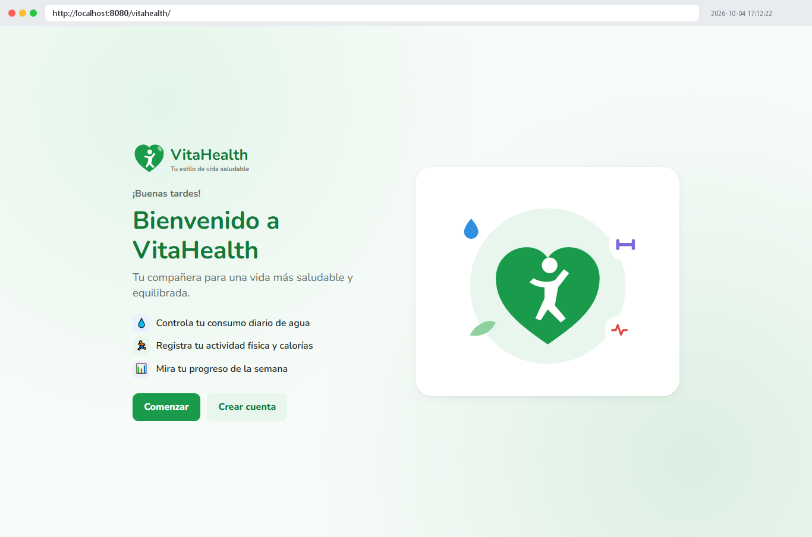 Bienvenida | 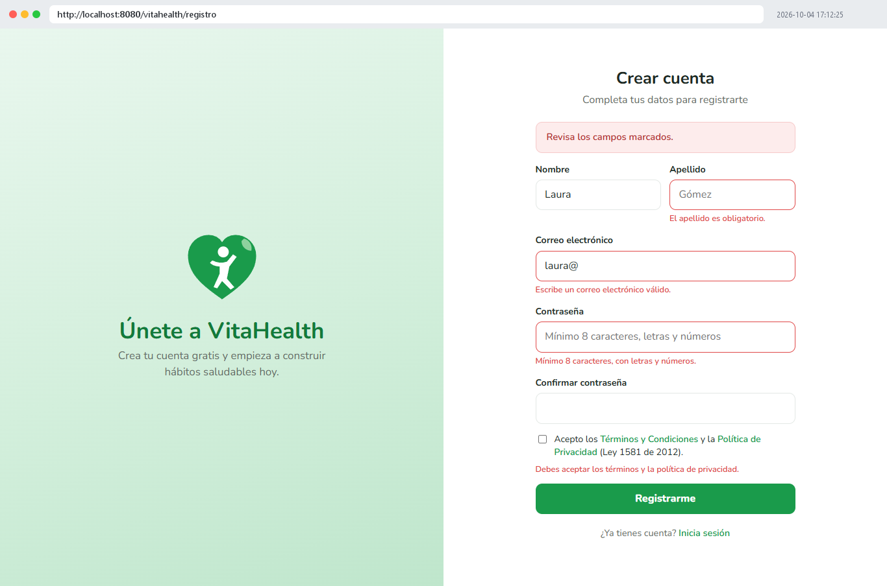 Registro: validaciones (POST) |
| 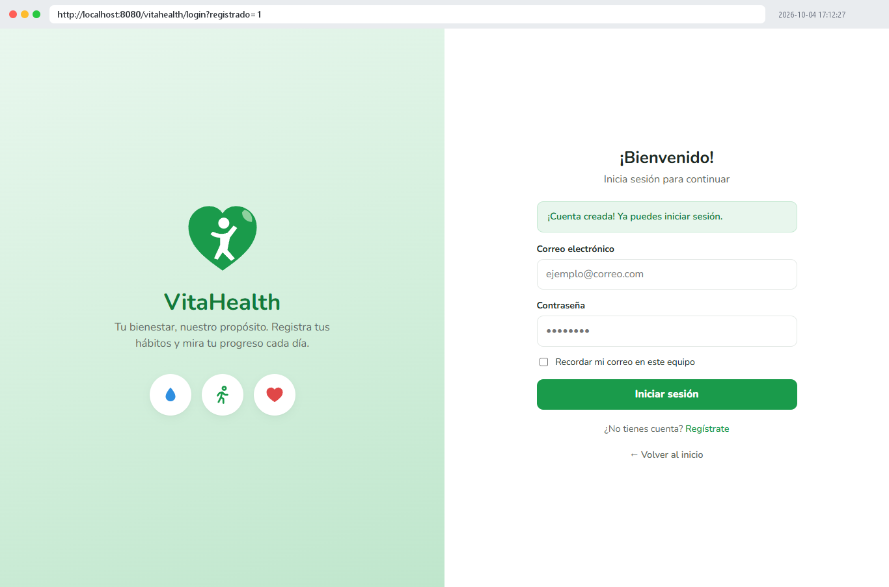 Cuenta creada y login | 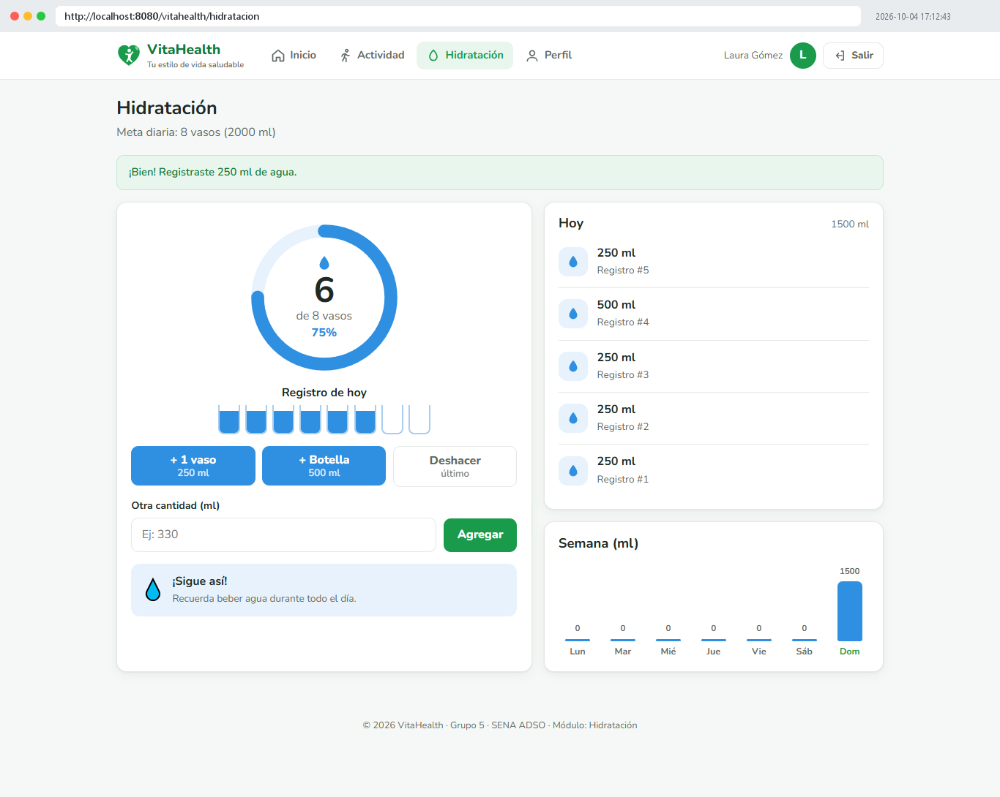 Hidratación (POST) |
| 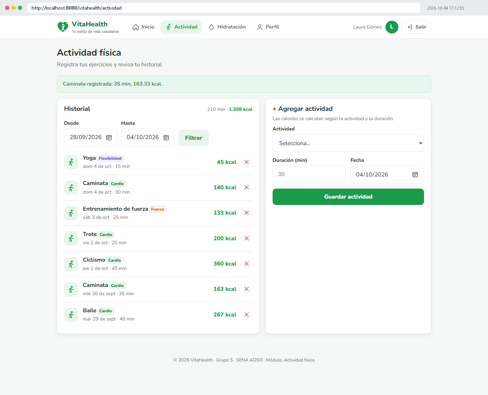 Actividad física (POST) | 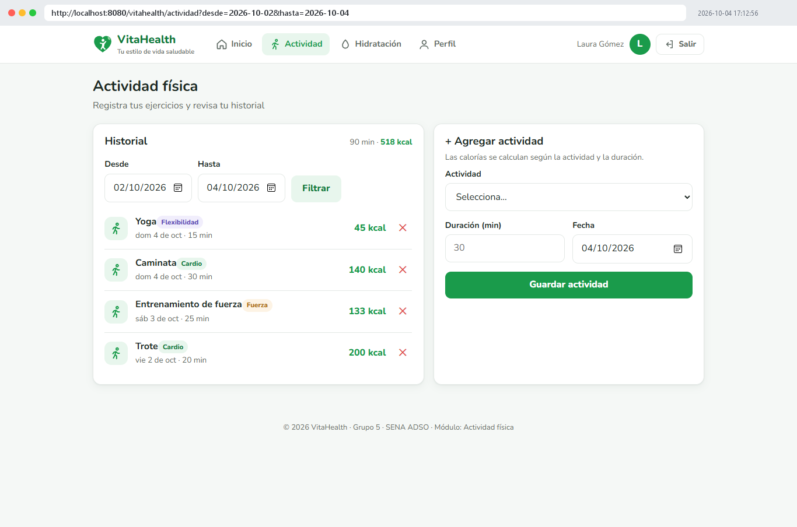 Filtro del historial (GET) |
| 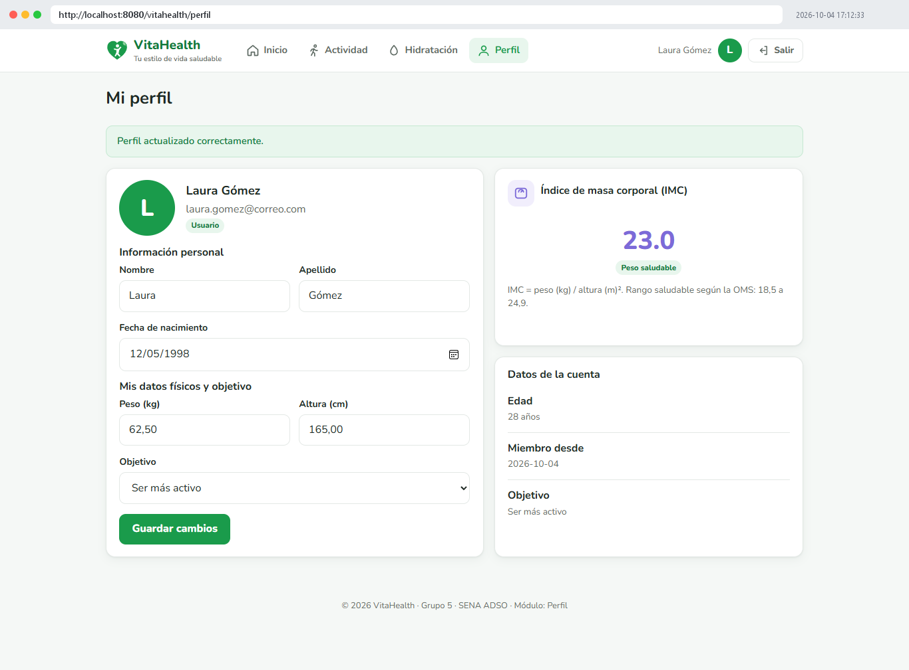 Perfil e IMC | 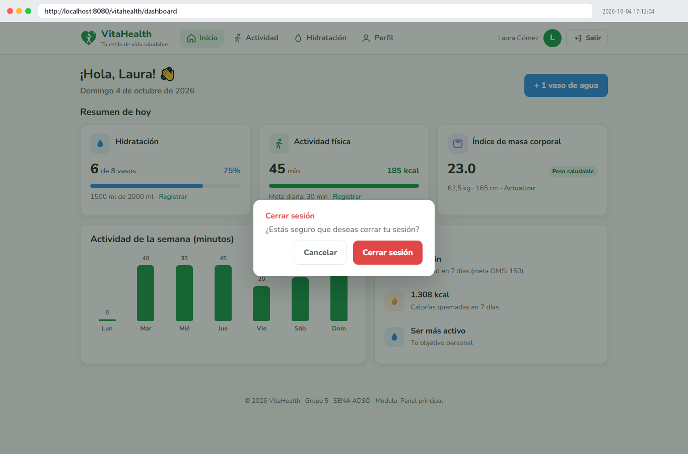 Cerrar sesión |
| 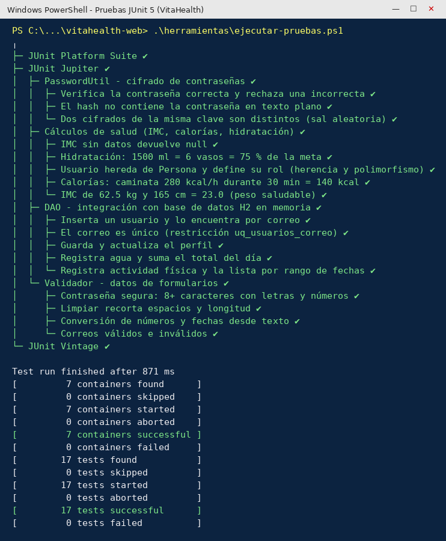 17 pruebas JUnit exitosas | 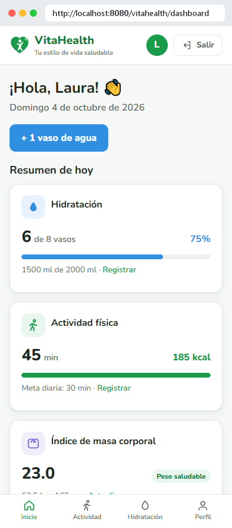 Vista móvil |

## Seguridad aplicada (RNF04)

- Las contraseñas se guardan con **PBKDF2‑HMAC‑SHA256**, con sal aleatoria y 65 536 iteraciones.
- Todas las consultas usan `PreparedStatement`, lo que evita la inyección SQL.
- Los datos que escribe el usuario se escapan en las vistas (`c:out`, `fn:escapeXml`) para prevenir XSS.
- `AutenticacionFiltro` protege las páginas internas. La sesión se renueva al iniciar sesión y expira tras 30 minutos.
- Cada usuario solo puede ver y borrar sus propios registros: el `id_usuario` se toma de la sesión, nunca del formulario.
